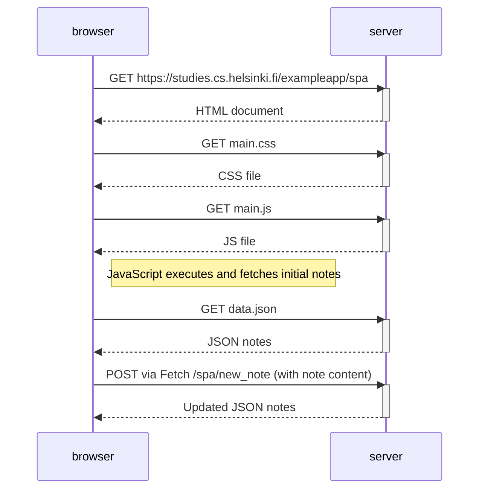

```mermaid
sequenceDiagram
    participant browser
    participant server

    browser->>server: GET https://studies.cs.helsinki.fi/exampleapp/spa
    activate server
    server-->>browser: HTML document
    deactivate server

    browser->>server: GET main.css
    activate server
    server-->>browser: CSS file
    deactivate server

    browser->>server: GET main.js
    activate server
    server-->>browser: JS file
    deactivate server

    Note right of browser: JavaScript executes and fetches initial notes
    browser->>server: GET data.json
    activate server
    server-->>browser: JSON notes
    deactivate server
    
    browser->>server: POST via Fetch /spa/new_note (with note content)
    activate server
    server-->>browser: Updated JSON notes
    deactivate server


```
